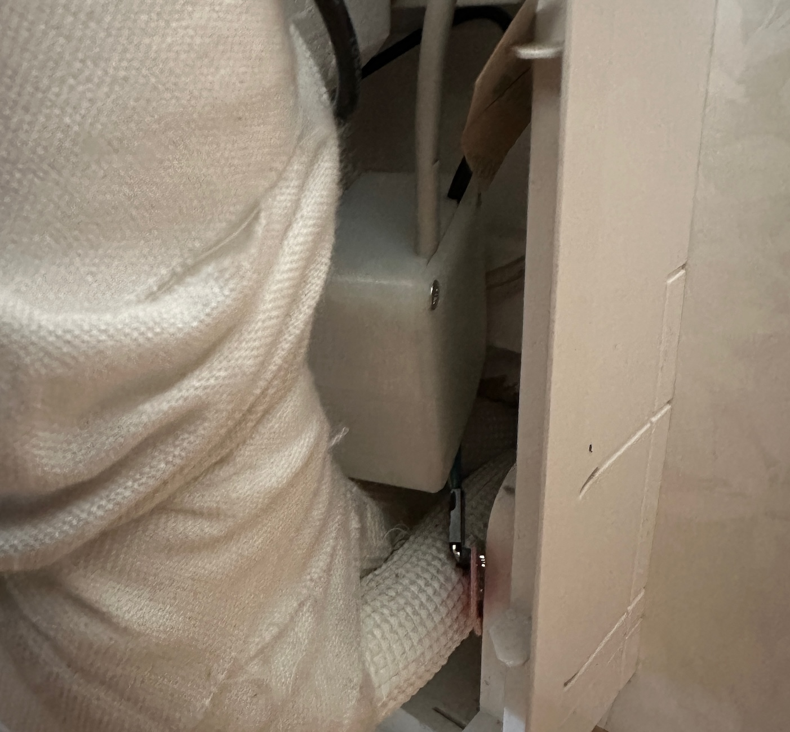

# Generic ESP32c3 board with IR blaster, IR receiverk, serial port, i2c and more

A small generic mini IO based on ESP32c3. This one has an IR blaster, IR receiver, and serial port with level shifter suitable for Mitsubishi CN105 port. Other ESP32c3 pins are available with pin headers for I2C, 1-wire, and other general purposes

## Introduction

This small IO board was made to easily fit inside a small DYI boxm, a heat pump or other. For Mitsubushi heat pumps, the CN105 connector is used for serial port communications and for power supply.

Some of the main features and benefits

- **Serial port with simple level shifter for 5V serial ports**
    - The CN105 port of Mitsubishi ports can be used - and will then also provide the power supply for the board
- **An IR blaster circuit**
    - Some features / command packets are easier to find from a native IR receiver
- **An IR receiver**
    - Available to use - but not tested with any firmwares yet.
      IR protocol decodes from a native remote control is probably easier to do from a Raspberry Pi or similar
- **I2C and/or 1-wire**
- **Other GPIO ports**
- **WiFi based**
    - This is almost a must have for most home automation systems
    - OTA support
    - Configuration backup, restore and bulk updates.
- **Firmware of your choise**
    - ESPEasy with Domoticz over http. Device creation uses virtual sensors
    - ESPEasy with Domotics and Home Assistant via MQTT. Device creation uses a MQTT configuration text file.
    - ESPHome to Home Assistant via MQTT and auto discovery
    - ESPHome to Domoticz via MQTT and auto discovery
    - ... and as the hardware supports using both Arduino and ESP-IF development kits, almost any other firmware can be created.

## Setup and mounting

The version 2.0 PCB needs an extra grounding wire:

<p align="center">
    
</p>

The wiring for a Mistubushi heat pump:

<p align="center">
    
</p>

A normal visible LED can be used in series with the IR LED - just in case you want to see the activity

Any small platic DYI box that fits easily inside the heat pump should do:

<p align="center">
    
</p>

The serial port - CN105 - on our Mitsubishi heat pumps:

<p align="center">
    
</p>

The IR sender led fits inside the receiver housing:

<p align="center">
    
</p>

The same PCB can be used for many other purposes. Here is for a firmware build test with CO2 sensor, I2C temp/humid and light, PIR sensor and a 1-wire temp sensor

<p align="center">
    
</p>


## Implementation and design

The detailed PCB diagram is [available here](KiCad/HeatPumpControl-schema-2.0.pdf)


## GPIO pin usage

| PIN      | Capabilty          | Function                            |
|----------|--------------------|-------------------------------------|
| GPIO2    | Pulled up          | N/A                                 |
| GPIO3/A1 | Generic IO         | On IR receiver pin header           |
| GPIO4    | Actice high out    | IR sender                           |
| GPIO5    | Generic IO         | Pull-up possible                    |
| GPIO6    | I2C                | SDA                                 |
| GPIO7    | I2C                | SCL                                 |
| GPIO9    | Active low out     | Internal status LED                 |
| GPIO10   | Generic IO         | Pull-up possible                    |
| GPIO20   | RX                 | Serial to heatpump TX               |
| GPIO21   | TX                 | Serial to heatpump RX               |


## Hardware - getting started

This project uses my [KiCad-lib-ESP32 repository](https://github.com/hansrune/KiCad-lib-ESP32.git) as a [git submodule](https://www.git-scm.com/book/en/v2/Git-Tools-Submodules). To check this out, use the following:

```bash
git clone --recurse-submodules https://github.com/hansrune/HeatPumpControl.git 
```

### Materials used

This project uses the [Seed Studio XIAO ESP32C3 RISC-V module](https://www.seeedstudio.com/Seeed-XIAO-ESP32C3-p-5431.html). This tiny device has proven to be more reliable than most ESP8266 modules used in earlier versions. This module also comes with an IPX connector for connecting an external antenna, and is delivered with a simple external antenna for good range.

5V power can be supplied over USB-C or the serial port pin headers

For more information, use [this KiCad BOM](KiCad/HeatPumpControl-BOM.csv)

## Hardware assembly

Soldering a prototype by hand is possible if you have a steady hand and a small solder iron tip. A microscope is recommended to propely inspect the solder joints.

Recommend to do the SMD parts first, then other components.

## Known bugs

The version 2.0 PCB has a few flaws

- The NPN-tranistor upside down
- The copper fill grounding is missing for the IR receiver GND pin. An added wire is needed if you use it

<!-- 

## How to contribute

-->

## License

This project is licensed under the [GNU General Public License v3.0](GNU-LICENSE-V3.txt) for the software, [CERN-OHL-W](OHL-LICENSE.txt) for the hardwaremm, and [CC BY-SA](CC-BY-SA-LICENCE.txt) for the documentation and ideas.

<p align="center" width="100%">
    
</p>

